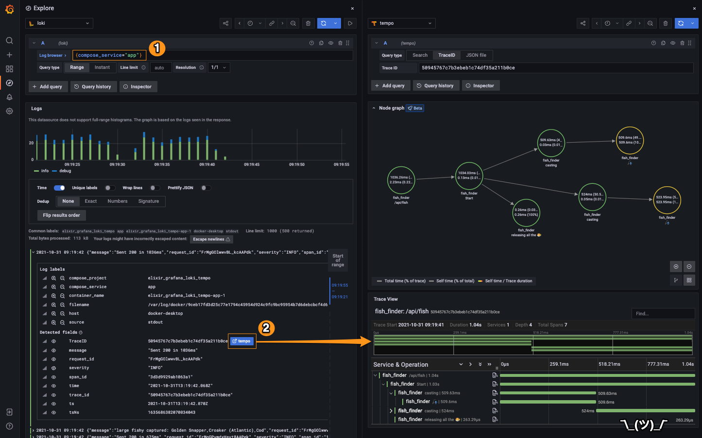

# Elixir, Grafana, Prometheus, Loki, Tempo, OpenTelemetry and friends

Following along with the experience described in this article: [How to successfully correlate metrics, logs, and traces in Grafana](https://grafana.com/blog/2020/03/31/how-to-successfully-correlate-metrics-logs-and-traces-in-grafana/), using: Elixir, Grafana Tempo and Loki, with the majestic support of Elixir's own ecosystem; a very simple demo/experimental project 🎣

## Setup

To handle shipping logs from docker, we need to install a docker plugin:

```sh
docker plugin install grafana/loki-docker-driver:latest --alias loki --grant-all-permissions
```

If you would like to disable this plugin after completing the tutorial, simply run:

```sh
docker plugin disable loki
```

Once that's done, we can simple bring up the services:

```sh
docker-compose up -d
```

> Note: the mini Elixir app included with this demo project will take care of itself; bring dependencies, compile, start, etc.

Once that's up you should be able to access the following services:

- Grafana: <http://localhost:3000/>, w/ a smol' demo dashboard included 😜
- _more details about the services started, in the `docker-compose.yaml`_

## Play time

We can use `curl` for producing some logs. Example:

```sh
curl 'http://localhost:4000/api/fish'
["Hake","Jack (Amber, Crevalle)","Mahi Mahi (Dolphin-fish)","Chilean sea bass"]
```

or you can use some mild load, and gather even more log/trace samples:

```sh
ab -n 50 -c 4 http://localhost:4000/api/fish
```

### Loki, Tempo; some breadcrumbs

Visit your local Grafana endpoint and select the `Explore` menu. With the Loki datasource selected, run the following query in the `Log browser` text field:`{compose_service="app"}`

If you expand the logs, you should be able to see a `Tempo` button. Click on it to view the associated trace. You'd probably see something similar to this:



That's all 🤷🏻‍♂️

HTH

### TODOs

```todo
✓ make the Tempo button work in the Loki logs (done)
- make the Log button work from Tempo
```
